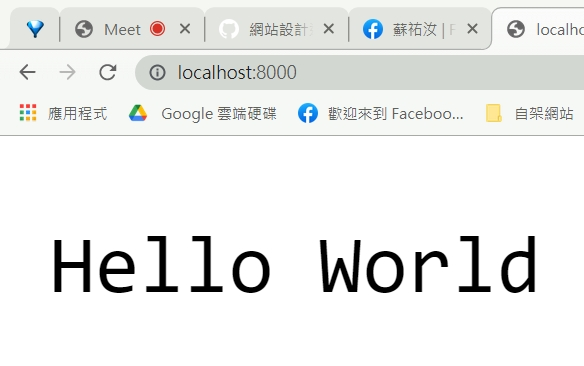

# W1課堂筆記/紀錄
## 問題
* deno無法使用?
    * 用使用者權限開啟  VSCODE
* 網頁無法打開?
    * 檢查其他終端機是否有占用通訊埠,將其cirl+c跳出

## 紀錄
1.  WS\ws\02-http\01-hello\helloServer.js  
```
  
http://localhost:8000/
```
點進網址 會顯示 "HELLO WORLD"


2. WS\ws\11-crawler\02-curl
    * [curl教程](http://www.ruanyifeng.com/blog/2019/09/curl-reference.html)
    * -i
    * -I 

3. ws\02-http\02-fileServer\htmlServer.js
```
deno run -A htmlServer.js

http://localhost:8000/index.html
```
4. OAK(ws/03-oak/01-basic)
```
$ deno run -A oakHello.js

start at : http://127.0.0.1:8000
```
```
$ deno run -A oakHtml.js

start at : http://127.0.0.1:8000
```
```
app.use((ctx) => {
  ctx.response.body = "Hello World!";
});
```