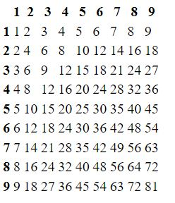

# W3 oak 框架
# 課堂筆記/紀錄
>練習[proj1](https://github.com/ukarara/ws110a/tree/master/proj1)

## 樣板字面值（Template literals）
>`` 允許嵌入運算式的字串字面值（string literals）
```
`${運算式}`
```
```
for (let j=1; j<=9; j++){
            row += `<td>${i*j}</td>`
        }

```
顯示結果


## 轉檔' > '
```
deno run name.js > name.html
```

## [deno debugger](https://deno.land/manual@v1.0.0/tools/debugger) (額外下載)
>可以進行調適，不過開發網站的人比較常用[denon](https://deno.land/x/denon@2.4.9)，程式碼一改就重啟伺服器

## chain()
```
router.get().get().get() = router.get()
```
## 重要
```
.get("/book/:id"    //記住router使用':'
context.params  //(context是自定義變數,likes 'book')
context.params.id
```