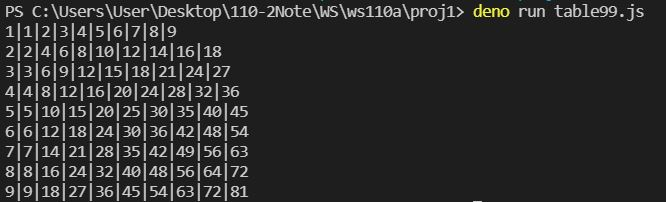
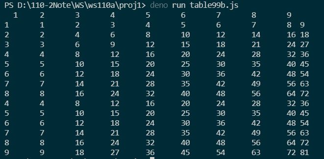
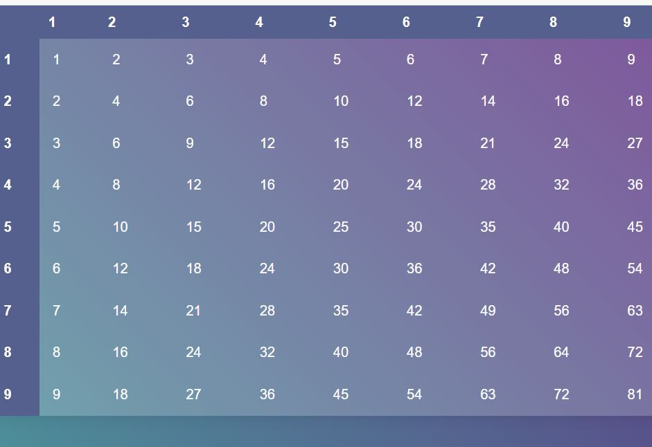

# 題目
1. 回應純文字版的九九乘法表
2. 回應純HTML版的九九乘法表  
說明：格式如下  

|.|1|2|......|9|
|---|---|---|---|---|
|1|1|2|......|9| 
|2|2|4|......|18|
|...				  
|9|9|18|......|81|

## Q1: table99.js 

## Q2: table99html.js
[CSS](https://codepen.io/alexerlandsson/pen/mPWgpO?editors=1100)

